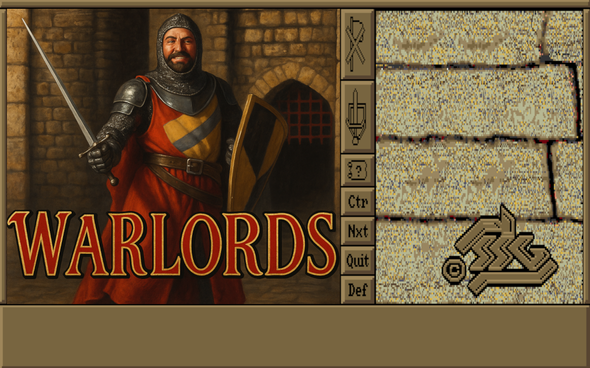

# Warlords

## Motivation

I'm a long-time fan of the original [Warlords](https://en.wikipedia.org/wiki/Warlords_(1990_video_game)) computer game.
This project is a labor of love — my (free time) goal is to gradually bring this brilliant, atmospheric, and tactically rich game back to life, piece by piece.
That includes reverse engineering the original data formats, rebuilding compatible tools, and possibly enabling modern usage, preservation, or modding.
This repository contains my findings, tools, decoders, converters, and maybe someday even a remastered or ported version of parts of the game.

A **secondary goal** of this project is to **evaluate how modern AI tools can assist in reverse engineering, restoration, and visualization** of classic software.
This very repository — and the code, decoders, and insights it contains — were heavily accelerated through interactive AI-assisted analysis.
From disassembling EXE routines to decoding image compression schemes and VGA bitplanes, AI served as a collaborator — not just a calculator.

It's both an act of restoration and a form of experimentation: **can an enthusiast with curiosity and good AI tooling revive a lost game format?**

## About the Game – *Warlords* (1990)

*Warlords* is a fantasy turn-based strategy game originally released in 1990 for the Amiga and MS-DOS, and later in 1992 for the Macintosh.  
It was designed by [Steve Fawkner](https://en.wikipedia.org/wiki/Steve_Fawkner) and developed by Strategic Studies Group.

Set in the mythical land of **Illuria**, the game features eight clans vying for domination:

- Sirians  
- Storm Giants  
- Grey Dwarves  
- Orcs of Kor  
- Elvallie  
- Horse Lords  
- Selentines  
- Lord Bane

Gameplay centers around capturing cities, producing units, exploring ancient ruins with hero characters, and uncovering relics or allies.
Victory is achieved by controlling at least **two-thirds of the cities** on the map.

Warlords was known for:
- Deep yet accessible strategy
- Surprising replayability
- Atmospheric artwork
- One of the earliest forms of "hotseat" multiplayer on PC

## What’s in This Repository

This repository includes (or will include):

- ✅ [Decoder](./pck) for `.PCK` files and sprite/image formats
- ✅ [Decoder](./map) for `ILLURIA.MAP` file (the game map) including mapping to graphic tiles from `PICT/SCENERY.PCK`
- [ ] [Reverse engineering](https://github.com/ateska/warlords/wiki/Reverse-engineering) notes from EXE disassembly and memory tracing
- [ ] Experimental visualizations and upscalers

All code is open-source, educational, and designed to assist others in understanding or restoring Warlords content.
Contributions welcome!

## Project Goals

- Decode and document proprietary formats (`.PCK`, `.MAP`, etc.)
- Reconstruct and visualize in-game assets
- Extract original VGA palettes and apply them correctly
- Annotate EXE behavior and sprite routines
- (Future) Rebuild or emulate Warlords mechanics with modern tools
- (Maybe) Create a lightweight launcher or modding tool

## Why Open Source?

Preserving classic games — not just the playable binaries, but the *creative architecture behind them* — matters.
My hope is that by sharing these tools and notes, more fans, modders, and retro-engineering enthusiasts can contribute or benefit.

If you're interested in collaborating or know something about SSG’s formats, let me know!

## Getting the Game Assets (Legally)

To use the tools and scripts in this repository, you'll need access to the original game files — such as `WARLORDS.EXE`, `.PCK` images, or map files.
These are **not included here** due to copyright restrictions.

The most reliable and legal way to obtain these assets is by purchasing the game from [GOG.com]([https://www.gog.com/).
GOG sells *Warlords 1 + 2 Deluxe* as a DRM-free package, bundled with DOSBox for easy launching.

After installing it, you’ll find the game files inside the GOG installation directory — typically:

- **Windows:** `C:\GOG Games\Warlords\`
- **macOS:** `/Applications/Warlords.app/Contents/Resources/game`

You can copy the necessary `.PCK`, `.EXE`, or other binary files into this project folder to begin inspecting or extracting content.

Please support the original creators and rights holders by purchasing a legal copy if you haven’t already.

## License

This project is released under the **BSD License**.  
See [LICENSE](./LICENSE) for details.

---

*This is a fan-made project. All original content belongs to their respective copyright holders.*
